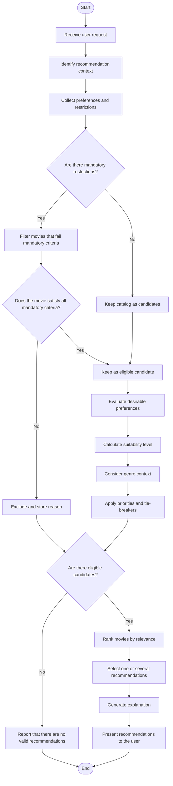
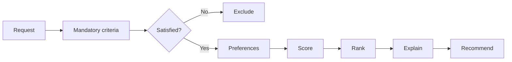

# High-Level Flowchart - Expert Decisions

Based on the interview with expert Joao Mota about the movie recommendation expert system.

This document presents a macro-level view of the decision process. The goal is to show how the system should reason before detailing Prolog rules, Drools rules, weights, or technical implementation.

## General Principle

The system should help the user discover movies they are likely to enjoy, while first respecting mandatory conditions and then using the remaining preferences to rank the best alternatives.

The expert separates criteria into two types:

- **Mandatory restrictions**: if they fail, the movie must be excluded.
- **Desirable preferences**: if they match, they increase the score; if they fail, they do not necessarily exclude the movie.

## Macro Flowchart

## Main Expert Decisions

### 1. Understand The Request

Before recommending, the system should understand what the user is looking for at that moment:

- discovering something new;
- choosing between several options;
- finding a movie for a specific audience;
- finding a movie similar to others they liked;
- respecting a concrete situation, such as watching with children or using an available streaming platform.

### 2. Separate Mandatory From Desirable

This is the central expert decision.

A mandatory criterion eliminates movies. A desirable preference only influences the score.

Examples of mandatory criteria when defined by the user:

- maximum duration;
- language;
- release period or year;
- suitable age rating;
- language/content suitable for the audience;
- explicitly rejected genre;
- explicitly rejected director or actor;
- already watched movie, except when the user wants rewatch suggestions.

Examples of desirable preferences:

- preferred genre;
- minimum rating, when not treated as a hard requirement;
- preferred director;
- preferred actors;
- similarity to movies previously liked;
- belonging to a saga or series of interest;
- availability on an accessible platform.

### 3. Apply Exclusions First

The expert was clear: a good score in other criteria should not compensate for a mandatory violation.

Therefore, the system should first exclude movies that:

- belong to rejected genres;
- do not respect mandatory duration, language, or period;
- are not suitable for the actual audience;
- have an incompatible age rating or type of content;
- have already been watched, if the request does not allow rewatching.

### 4. Score Only Eligible Movies

After mandatory filters, the system evaluates the remaining movies.

The score should use weights, not just count matched criteria. Matching an important preference should matter more than matching a secondary one.

Suggested priority from the expert:

1. Genre.
2. Rating, interpreted in the context of the genre.
3. Similarity to movies the user liked.
4. Director.
5. Actors.
6. Practical availability.

### 5. Interpret Ratings With Context

The expert indicated that ratings should not be used with the same rigid threshold for every genre.

Example: a comedy with a lower rating may still be a good recommendation, because some genres tend to have different average ratings.

The system should evaluate:

- absolute rating value;
- distance from the requested minimum;
- movie genre;
- allowed tolerance margin.

### 6. Allow Alternatives

When a movie fails a desirable preference, it may still be recommended if its overall suitability is good.

Example: if the user asked for a minimum rating of 8, a movie rated 7.5 may appear as an alternative if:

- the minimum is not mandatory;
- a tolerance margin exists;
- the movie satisfies more important criteria;
- the explanation clearly states what was not fully satisfied.

### 7. Rank And Justify

The result should not be only a list. It should explain why each movie was recommended.

The explanation should include:

- matched preferences;
- mandatory criteria that were respected;
- factors with the strongest impact on the score;
- preferences not fully satisfied, when relevant;
- exclusion reasons, when there are not enough recommendations.

## Simplified Decision Flow

## Next Level Of Detail

This flowchart is intentionally high-level. In a next step, it can be split into more specific flowcharts, for example:

- mandatory exclusion flow;
- score calculation flow;
- user recommendation flow;
- movie similarity flow;
- recommendation explanation flow;
- comparison flow between Prolog and Drools.
