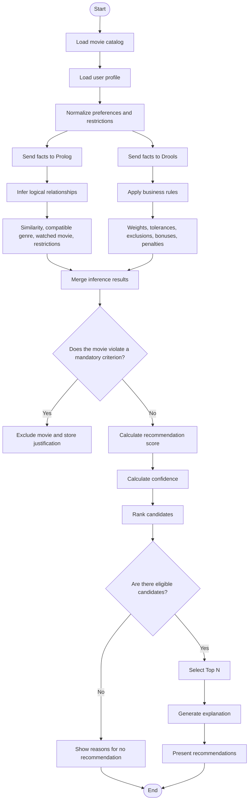

# Flowchart - Movie Recommendation System

## Brief Repository Analysis

The current repository does not yet contain a Prolog, Drools, Java, or inference engine implementation in the checked-out branch. The current structure only contains base documentation:

- `README.md`: identifies the project as `Inference Engine` and describes the branch policy.
- `docs/branch-management.md`: operational guide for creating, synchronizing, and merging branches.
- `origin/feature/docs-fluxogram`: remote branch with an initial PlantUML draft for the recommendation flow.

Therefore, the flowchart below is a conceptual proposal for the future implementation, based on the system goal and the interview with expert Joao Mota.

## Knowledge Extracted From The Interview

The system should recommend movies that the user will probably enjoy, while also helping them discover new options. The recommendation should first respect mandatory criteria and only then calculate suitability through scoring.

Mandatory criteria when defined by the user:

- maximum duration;
- language;
- release period or year;
- age rating and content suitable for the actual audience;
- explicitly rejected genres, directors, or actors;
- already watched movie, except when the request allows rewatching.

Desirable preferences for scoring:

- preferred genre;
- minimum rating, with a possible tolerance margin;
- preferred director and actors;
- similarity to movies previously liked;
- movie belonging to a saga or series the user likes;
- availability on an accessible platform.

Suggested ranking hierarchy:

1. Mandatory restrictions.
2. Genre.
3. Rating, interpreted in the context of the genre.
4. Similarity to liked movies.
5. Director and actors.
6. Practical availability.

## Role Of Prolog And Drools

Prolog can be used to represent facts and logical queries: movies, genres, actors, ratings, user restrictions, and similarity relationships.

Drools can be used to apply business rules with weights, exclusions, scoring, tolerance margins, and explanations. The same conceptual base should be maintained across both engines so that the results can be compared.

## Sample Flowchart

## Example Extracted Rules

- If the movie belongs to an explicitly rejected genre, then it must be excluded.
- If the movie violates mandatory duration, language, or period, then it must be excluded.
- If the movie genre matches the preferred genre, then the score increases.
- If the rating is above the minimum, then the score increases.
- If the rating is close to the minimum and tolerance is allowed, then the movie can be an alternative.
- If the director or actors are among the preferred ones, then the score increases.
- If the movie has already been watched, then it should not be recommended, except when the user wants rewatch suggestions.
- If no movie satisfies all desirable preferences, then the closest alternatives should be shown, explaining what did not match.
